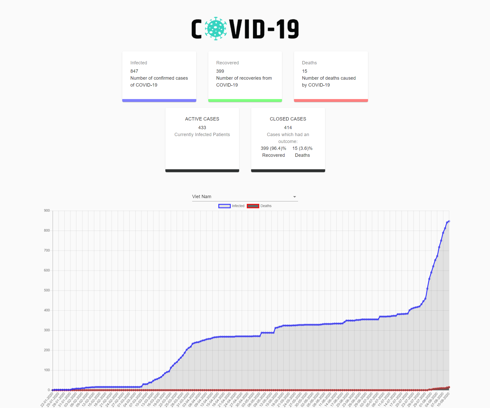

## COVID-19 Tracker App - React JS

This is a modified version of the project (https://github.com/adrianhajdin/project_corona_tracker) using different API along with added components. 

### Technologies

- Reat JS, Charts js, Material-UI
- API: (https://covid19api.com)

### Description

A COVID-19 tracker app that show the current state of pandemic globally and specifically to each country. The stats include the number of Infected, Active, Recoverd, Death cases along with percent of Recovered to Death cases. The app also provide a line chart including the number of infected and death paitents which are arranged chronically from the beginning of pandemic to the current date. 

